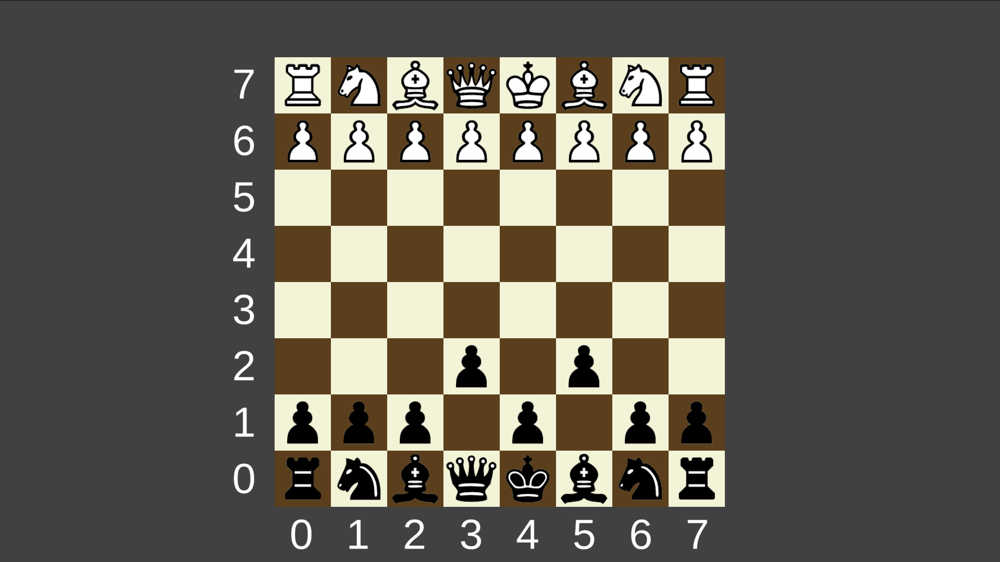

# 🎨 Color Stack

> A timing-based stacking game focused on precision and visual feedback.

---

## 🎥 Gameplay

  

---

## 📸 Preview

  

---

## 🧠 What I Built

* Platform spawning system  
* Stacking mechanics  
* Feedback and scoring system  

---

## 🚀 Features

* Smooth gameplay experience  
* Color-based stacking  
* Score progression system  

---

## ⚙️ Tech Stack

  

---

## ▶️ How to Run

1. Clone repository  
2. Open in Unity  
3. Press Play  

---
